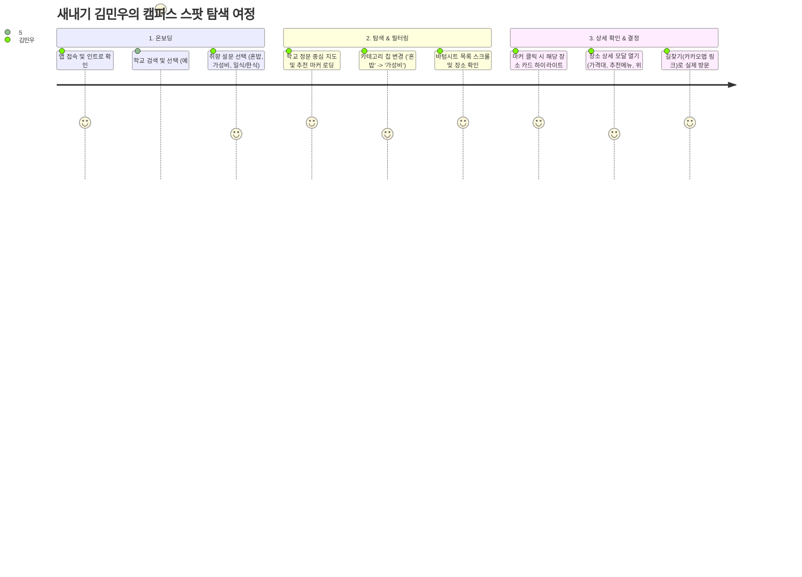
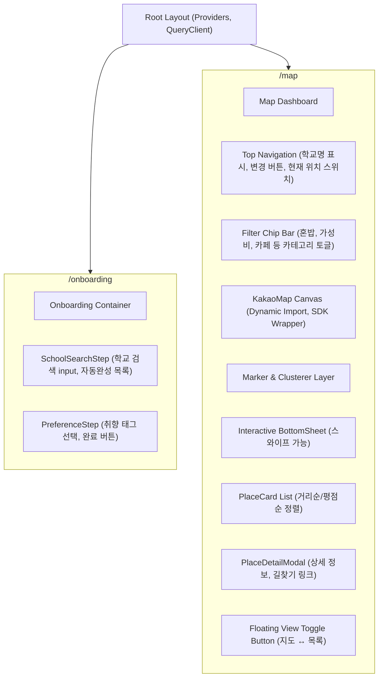
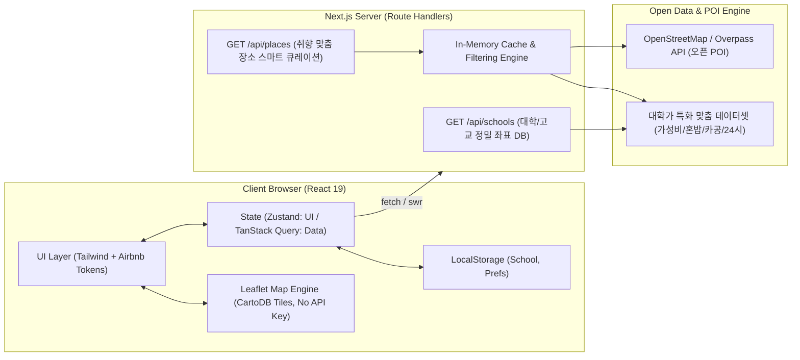
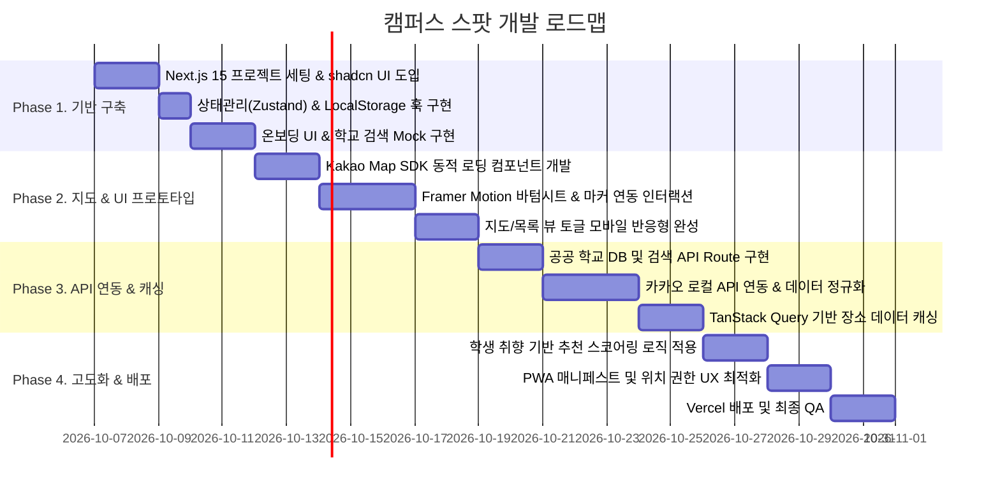

# [PRD] 학교 주변 맛집 & 편의시설 맞춤 지도 웹앱 (Campus Spot)

> **문서 버전**: v1.0.0  
> **작성일**: 2026-10-06  
> **작성자**: Senior PM & Full-Stack Architect  
> **대상 플랫폼**: Mobile First Responsive Web (Next.js App Router)  
> **문서 상태**: Approved (Ready for Implementation)

---

## 1. 프로젝트 개요 (Overview)

### 1.1 프로젝트 배경 및 목적
- **배경**: 대학가 및 중·고등학교 주변은 매 학기 신입생, 편입생, 복학생, 자취생 등 새로운 유입이 지속적으로 발생하는 상권입니다. 그러나 기존 포털 지도(네이버/카카오 지도)는 정보량이 지나치게 방대하여 "혼밥하기 좋은 곳", "가성비 뛰어난 밥집", "공부하기 좋은 콘센트 많은 카페", "시험기간 24시 영업 편의시설" 등 **학생들의 특수한 라이프스타일과 취향에 맞춘 직관적인 탐색**이 어렵습니다.
- **목적**: 간편한 온보딩(학교 선택 및 취향 조사)을 통해 복잡한 검색 과정 없이, 학생 개개인의 취향과 현재/학교 위치 기반으로 선별된 맛집 및 편의시설을 지도와 피드로 큐레이션하는 모바일 중심 웹 애플리케이션을 제공합니다.

### 1.2 타겟 유저
- **주요 타겟 (Primary)**: 학교 주변 지리가 낯선 신입생/편입생 및 학교 인근 거주 자취생 (만 18세 ~ 26세)
- **보조 타겟 (Secondary)**: 
  - 학교 주변에서 매일 점심/저녁 메뉴를 고민하는 재학생 및 대학원생
  - 가성비 및 혼밥 친화적인 스팟을 빠르게 찾고 싶은 중·고등학생 및 교직원

### 1.3 핵심 가치 (Core Values)
1. **Zero-Friction 맞춤화 (No-Login Personalized)**: 복잡한 회원가입 없이 온보딩 설문(학교 + 취향 태그)을 통해 즉시 개인화된 지도 뷰 제공 (LocalStorage/쿠키 기반).
2. **Context-Aware 큐레이션 (상황별 탐색)**: '혼밥', '가성비(1만원 이하)', '카공(콘센트/와이파이)', '단체 모임/회식', '24시 스터디/편의' 등 학생 특화 필터 제공.
3. **Seamless UX (지도와 목록의 유기적 동기화)**: 모바일 스와이프 바텀시트(Bottom Sheet)와 지도 마커 간의 즉각적인 상호 인터랙션 제공.

---

## 2. 타겟 유저 페르소나 및 유저 시나리오

### 2.1 타겟 유저 페르소나

| 항목 | 페르소나 A (새내기 자취생) | 페르소나 B (시험기간 대학생) |
| :--- | :--- | :--- |
| **이름/나이** | 김민우 (20세, 대학교 1학년) | 이서연 (22세, 대학교 3학년) |
| **상황** | 타지에서 올라와 학교 정문 근처 원룸에서 자취 시작 | 중간고사 시험기간, 연강 사이 틈새 시간 활용 필요 |
| **Pain Points** | - 학교 주변 밥집을 몰라 매번 배달앱이나 편의점 삼각김밥으로 때움<br>- 혼자 들어가서 먹기 눈치 보이지 않는 식당 정보가 부족함 | - 24시간 운영하거나 밤늦게까지 하는 카페/스터디룸을 일일이 검색해야 함<br>- 콘센트 유무나 조용한 분위기인지 파악하기 어려움 |
| **Needs** | - 7,000~9,000원대 혼밥 가능한 학교 앞 백반/면류 맛집<br>- 정문/후문에서 도보 5분 이내 접근성 | - 새벽 2시 이후에도 열려 있는 24시 스팟<br>- 카공(카페 공부) 눈치 안 보이는 넓은 매장 |

### 2.2 핵심 유저 여정 시나리오 (User Journey Map)



---

## 3. 주요 기능 명세 (Feature Specifications)

### 3.1 온보딩 시스템 (Onboarding & Preferences)

| 기능 ID | 기능명 | 설명 | 우선순위 |
| :--- | :--- | :--- | :---: |
| **ONB-01** | 학교 검색 및 자동완성 | 전국 대학교/고등학교 명칭을 실시간 검색하고 공식 좌표(위경도)를 매핑 | P0 |
| **ONB-02** | 취향 설문 (Multi-Select) | 학생 라이프스타일 키워드 복수 선택<br>- **분위기/목적**: `#혼밥친화`, `#가성비최고`, `#카공_분위기`, `#단체모임_회식`, `#야식_24시`<br>- **음식 카테고리**: `#한식/백반`, `#양식/버거`, `#일식/돈카츠`, `#중식`, `#분식/포장`, `#카페/디저트` | P0 |
| **ONB-03** | 온보딩 상태 영속화 | 설문 완료 시 `user_campus_prefs` 객체를 `LocalStorage` 및 쿠키에 저장.<br>이후 재방문 시 온보딩을 건너뛰고 메인 지도로 바로 라우팅 | P0 |
| **ONB-04** | 설정 변경 (Reset/Edit) | 메인 상단 헤더의 학교 태그 클릭 시 온보딩 변경 모달을 띄워 학교/취향 즉시 재설정 가능 | P1 |

#### 데이터 모델 (LocalStorage Schema)
```typescript
interface UserCampusPreferences {
  version: "1.0";
  school: {
    id: string;
    name: string;
    campusType: "UNIVERSITY" | "HIGH_SCHOOL";
    lat: number;
    lng: number;
    address: string;
  };
  preferences: {
    purposes: string[];   // ['SOLO', 'BUDGET', 'STUDY_CAFE']
    categories: string[]; // ['KOREAN', 'JAPANESE', 'CAFE']
  };
  locationMode: "SCHOOL_CENTER" | "CURRENT_GEO";
  radiusMeters: number;   // 기본 1000m (1km)
  lastUpdated: string;    // ISO Date String
}
```

---

### 3.2 위치 & Open API 데이터 연동 (Location & Places)

| 기능 ID | 기능명 | 설명 | 우선순위 |
| :--- | :--- | :--- | :---: |
| **LOC-01** | 기준 위치 설정 | 온보딩 학교 중심 좌표를 Default로 지정하되, 브라우저 GeoLocation 권한 승인 시 '내 현재 위치'로 스위칭 가능 | P0 |
| **LOC-02** | 반경 기반 장소 쿼리 | 기준 좌표(lat, lng)로부터 반경(500m / 1km / 1.5km) 내 장소 목록 조회 | P0 |
| **LOC-03** | 다중 Open API 하이브리드 수집 | 1. **카카오 로컬 API**: 키워드/카테고리 검색, 세부 메타데이터 수집<br>2. **소상공인 상권정보 Open API**: 인근 업종별 상권 데이터 크로스체크<br>3. Next.js Route Handler에서 결과를 클러스터링/정규화하여 프론트에 전달 | P0 |
| **LOC-04** | API 응답 캐싱 & Rate Limit 방어 | 동일 좌표/반경 쿼리에 대해 Next.js Data Cache 또는 인메모리 LRU Cache(stale-while-revalidate) 적용 | P1 |

---

### 3.3 지도 인터랙션 (Map Interaction & UI)

| 기능 ID | 기능명 | 설명 | 우선순위 |
| :--- | :--- | :--- | :---: |
| **MAP-01** | 지도 렌더링 & SDK 래핑 | 카카오맵(Kakao Maps SDK) 또는 네이버 지도 Web SDK를 React 19 환경에서 번들링 이슈 없이 dynamic import로 초기화 | P0 |
| **MAP-02** | 커스텀 마커 & 클러스터러 | - 맛집(오렌지), 카페(브라운), 편의/스터디(블루) 등 카테고리별 커스텀 핀 렌더링<br>- 확대/축소 시 클러스터러(Clusterer)를 통해 마커 뭉침 방지 | P0 |
| **MAP-03** | 마커 - 리스트 양방향 동기화 | - 지도 마커 탭: 하단 바텀시트에서 해당 장소 카드로 자동 스크롤 & 활성화<br>- 목록 카드 클릭: 지도가 해당 좌표로 부드럽게 이동(panTo) 및 마커 강조 | P0 |
| **MAP-04** | 지도/목록 뷰 토글 (모바일) | 모바일 화면 하단 플로팅 버튼을 통해 `지도 전용 뷰`와 `전체 목록(피드) 뷰` 즉각 전환 | P0 |
| **MAP-05** | 장소 상세 정보 Sheet/Modal | 장소 클릭 시 바텀시트 확장 또는 모달 노출: 매장명, 카테고리 태그, 거리(m), 학생 추천 태그, 주소, 카카오/네이버 길찾기 연동 링크 | P0 |
| **MAP-06** | 동적 필터 칩 (Quick Filter Chips) | 지도 상단에 가로 스크롤 가능한 필터 칩(`전체`, `가성비`, `혼밥`, `카페`, `24시`) 제공으로 실시간 필터링 | P0 |

---

## 4. 정보 아키텍처 (Information Architecture & Page Structure)

### 4.1 사이트맵 및 페이지 라우팅 (Next.js App Router)

```
c:/last-work/
├── app/
│   ├── layout.tsx             # Root Layout (폰트, 전역 프로바이더, 메타데이터)
│   ├── page.tsx               # 온보딩 완료 여부 확인 후 리다이렉트 (Client Guard)
│   ├── onboarding/
│   │   └── page.tsx           # Step 1: 학교 선택 -> Step 2: 취향 설문
│   ├── map/
│   │   ├── page.tsx           # 메인 지도 화면 (Map + Floating UI + Bottom Sheet)
│   │   └── @modal/            # Intercepting Route (장소 상세 공유/딥링크용)
│   │       └── place/[id]/
│   │           └── page.tsx
│   ├── api/
│   │   ├── schools/
│   │   │   └── route.ts       # 학교 검색 API 프록시 (공공 DB / 정적 JSON 검색)
│   │   └── places/
│   │       ├── route.ts       # 좌표/반경/카테고리 기반 장소 쿼리 API 프록시
│   │       └── [id]/
│   │           └── route.ts   # 특정 장소 상세 정보 조회
```

### 4.2 컴포넌트 계층 다이어그램



---

## 5. 기술 아키텍처 및 Open API 명세

### 5.1 기술 스택 선정 및 아키텍처 다이어그램

| 계층 (Layer) | 채택 기술 | 선정 사유 |
| :--- | :--- | :--- |
| **Framework** | **Next.js 15+ (React 19)** | App Router 기반 Server Components 및 Route Handlers를 활용한 API 보안 및 최적 렌더링 |
| **Language** | **TypeScript 5.x** | 엄격한 타입 정의로 Open API 응답 정규화 및 런타임 오류 방지 |
| **Styling** | **Tailwind CSS + shadcn/ui** | `DESIGN-airbnb.md` 디자인 시스템 적용 (Rausch `#ff385c`, 둥근 카드, 캡슐 검색바) |
| **Animation** | **Framer Motion + Vaul** | 모바일 바텀시트 드래그 제스처 및 필터 칩 전환 애니메이션 최적화 |
| **State & Cache** | **Zustand + TanStack Query v5** | - **Zustand**: 지도 중심 좌표, 활성 마커 ID, 필터 상태 등 순수 클라이언트 UI 동기화<br>- **TanStack Query**: 좌표/필터별 장소 데이터 서버 캐싱, 중복 요청 제거, SWR 구현 |
| **Map Engine** | **Leaflet & React-Leaflet** | **API 키 발급 불필요 (No Key, No Domain Auth)**, CartoDB Voyager/OSM의 세련된 타일과 커스텀 HTML 마커 완벽 지원 |



### 5.2 Next.js API Routes / Server Actions 명세

#### 1) 학교 검색 API: `GET /api/schools?keyword={query}`
- **목적**: 온보딩 시 사용자가 입력한 학교명 자동완성 및 대표 좌표 제공
- **Response Format**:
```json
{
  "success": true,
  "data": [
    {
      "id": "univ-konkuk-seoul",
      "name": "건국대학교 서울캠퍼스",
      "campusType": "UNIVERSITY",
      "address": "서울특별시 광진구 능동로 120",
      "lat": 37.5407625,
      "lng": 127.0793428
    }
  ]
}
```

#### 2) 주변 장소 조회 API: `GET /api/places`
- **Query Parameters**:
  - `lat` (number): 중심 위도 (예: `37.5407625`)
  - `lng` (number): 중심 경도 (예: `127.0793428`)
  - `radius` (number): 반경 미터 단위 (기본값: `1000`, 최대: `2000`)
  - `category` (string, optional): `SOLO` | `BUDGET` | `STUDY_CAFE` | `NIGHT` 등
  - `sort` (string, optional): `distance` | `recommend` (기본값: `recommend`)
- **Processing**:
  1. 외부 카카오 로컬 검색 API(`https://dapi.kakao.com/v2/local/search/category.json` 및 `keyword.json`) 호출
  2. 서버 내부에서 클라이언트 요청 필터에 맞춰 가공 및 태그 부착 (예: 가격대, 키워드 매칭)
  3. 거리 계산(Haversine 공식) 및 정렬 후 응답
- **Response Format**:
```json
{
  "success": true,
  "meta": {
    "center": { "lat": 37.5407625, "lng": 127.0793428 },
    "totalCount": 42,
    "radius": 1000
  },
  "data": [
    {
      "id": "place-1029384",
      "name": "골목식당 건대본점",
      "categoryGroup": "FD6",
      "categoryName": "음식점 > 한식 > 찌개,백반",
      "customTags": ["#혼밥친화", "#가성비최고", "#학생할인"],
      "priceRange": "7,000원 ~ 9,000원",
      "rating": 4.6,
      "reviewCount": 128,
      "distanceMeters": 240,
      "lat": 37.54125,
      "lng": 127.07890,
      "address": "서울 광진구 능동로13길 12",
      "phone": "02-1234-5678",
      "kakaoPlaceUrl": "https://place.map.kakao.com/1029384",
      "isOpenNow": true,
      "operatingHours": "10:30 ~ 21:30"
    }
  ]
}
```

---

## 6. UI/UX 디자인 가이드라인

### 6.1 디자인 무드 & 디자인 원칙
- **Vibe**: 활기차고 스마트한 캠퍼스 감성 (Clean, Energetic, Youthful)
- **Mobile First**: 한 손 조작성을 최우선으로 고려하여 핵심 액션(필터 변경, 바텀시트 제어, 길찾기)을 하단 엄지손가락 영역(Thumb Zone)에 배치.
- **Micro-Interaction**: 마커 클릭 시 통통 튀는 바운스 효과, 바텀시트 스냅 포인트(Snap points: 15% 최소화, 50% 반 화면, 90% 전체 화면).

### 6.2 컬러 시스템 (Color Palette)

| 구분 | Color Code | 설명 / 사용처 |
| :--- | :--- | :--- |
| **Primary (Campus Orange)** | `#FF6B35` | 메인 브랜드 컬러, CTA 버튼, 활성 탭/필터 강조 |
| **Secondary (Indigo)** | `#2E4057` | 신뢰감을 주는 서브 컬러, 헤더 텍스트, 학교 배지 |
| **Background Light** | `#F8FAFC` | 슬레이트 50 베이스의 눈이 편안한 밝은 배경색 |
| **Surface/Card** | `#FFFFFF` | 장소 카드, 모달, 바텀시트 표면 |
| **Marker: 맛집** | `#FF5252` | 요식업 계열 지도 핀 (레드/코랄) |
| **Marker: 카페/스터디** | `#795548` | 커피/디저트/스터디룸 지도 핀 (브라운/웜그레이) |
| **Marker: 24시 편의시설** | `#2196F3` | 편의점, 빨래방, 24시 시설 지도 핀 (블루) |
| **Text Primary / Secondary**| `#1E293B` / `#64748B` | 제목 / 본문 및 메타 설명 |

### 6.3 핵심 컴포넌트 구조
1. **Header Bar**: 
   - 좌측: 서비스 로고 및 현재 설정된 학교 칩 (클릭 시 학교 변경 모달 오픈)
   - 우측: 내 위치 재설정 아이콘, 도움말 버튼
2. **Horizontal Quick Filter Bar**:
   - 상단 고정 가로 스크롤 칩: `전체`, `🍚 혼밥`, `💰 가성비`, `☕ 카공/콘센트`, `🌙 24시`, `🍻 단체모임`
3. **Interactive Bottom Sheet (Drawer)**:
   - Level 1 (Peek: 120px): 주변 추천 맛집 요약 카드 (가로 슬라이드)
   - Level 2 (Half: 50vh): 장소 목록 뷰 (거리순 정렬, 대표 메뉴, 가격대)
   - Level 3 (Expanded: 90vh): 필터링된 전체 리스트 무한스크롤
4. **Place Detail Card / Modal**:
   - 매장 사진 캐러셀, 카테고리 배지, 영업 상태(영업중/마감), 카카오맵/네이버맵 길찾기 바로가기 버튼

---

## 7. 개발 마일스톤 및 단계별 구현 계획 (Milestones)



### 단계별 상세 계획

#### Phase 1: 기반 구축 및 온보딩 플로우 (1주차)
- [ ] Next.js (App Router, React 19) 보일러플레이트 세팅
- [ ] Tailwind CSS v4, Lucide React, shadcn/ui 기본 컴포넌트(Button, Dialog, Badge, Input) 설치
- [ ] TypeScript 전역 타입 정의 (`School`, `UserPreferences`, `Place`, `FilterState`)
- [ ] `useLocalStorage` 훅 및 Zustand 기반 온보딩/필터 스토어 작성
- [ ] 온보딩 페이지 완성 (학교 검색 & 취향 멀티 선택 폼)

#### Phase 2: 지도 SDK 래핑 및 모바일 인터랙션 (2주차)
- [ ] Kakao Maps Script Loader 컴포넌트 (`Script` 태그 + strategy="afterInteractive")
- [ ] React 생명주기에 안전한 `MapContainer` 및 `CustomMarker` 컴포넌트 구축
- [ ] 모바일 터치 제스처를 지원하는 인터랙티브 바텀시트 컴포넌트 구현
- [ ] 마커 클릭 시 바텀시트 아이템 포커싱 및 스크롤 연동

#### Phase 3: Route Handlers 및 Open API 하이브리드 연동 (3주차)
- [ ] `GET /api/schools`: 전국 대학/고교 기본 좌표 DB 구축 및 검색 라우트 제공
- [ ] `GET /api/places`: 카카오 로컬 REST API 연동 (서버 환경변수 `KAKAO_REST_API_KEY` 보호)
- [ ] 반경(500m~1.5km) 및 카테고리 필터링 서버 로직 구현
- [ ] TanStack Query를 통한 지도 이동(`idle` 이벤트) 시 디바운스 쿼리 및 캐싱

#### Phase 4: 추천 알고리즘 고도화, QA 및 배포 (4주차)
- [ ] 사용자의 온보딩 취향 태그와 매장 카테고리 간의 가중치 매칭(추천 점수 순 정렬)
- [ ] 장소 상세 팝업 및 카카오/네이버 길찾기 URL Scheme 연동
- [ ] Lighthouse 성능 및 접근성 90점 이상 달성 (LCP 최적화, 이미지 Lazy loading)
- [ ] Vercel 프로덕션 배포 및 모바일 실기기 테스트

---

## 8. 위험 요소 및 대응 방안 (Risks & Mitigations)

1. **외부 지도 SDK 로딩 지연 / 깜빡임**:
   - *대응*: Next.js `<Script>` 태그 비동기 로드 + 지도 캔버스 스켈레톤 UI를 제공하여 로딩 체감 시간 최소화.
2. **카카오/공공데이터 API 일일 호출 쿼터 초과 위험**:
   - *대응*: 주요 대학가(반경 1km) 장소 데이터를 Next.js Data Cache(`revalidate: 86400` / 24시간)에 캐싱하여 중복 호출 90% 이상 절감.
3. **사용자의 브라우저 위치 권한 거부**:
   - *대응*: 위치 권한이 없더라도 온보딩에서 선택한 '학교 정문 중심 좌표'를 Default로 삼아 끊김 없는(Unbroken) 탐색 경험 제공.
